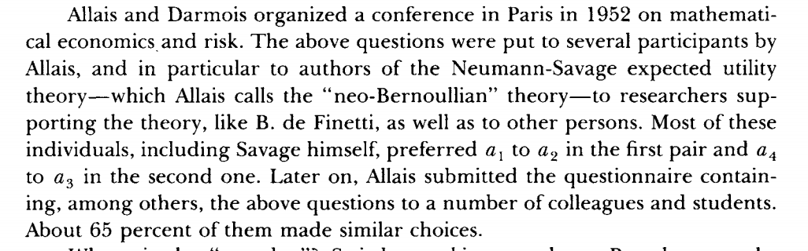

.. _section-1:

Préférences pour le risque
==========================

**De manière générale, les gens n'aiment pas le risque**

Pour s'en convaincre, imaginez vous faire offrir:

-  un revenu certain à la retraite de: 50 000/an

-  Un revenu incertain à la retraite (dès suite de placement)

   ====================== ======================
   **placement**          50% chance 10 000/an
   \                      50% chance 90 000/an
   ====================== ======================

-  Revenu espéré est de 50 000 dans les deux cas, lequel choisissez-vous?

Rendement et risque
~~~~~~~~~~~~~~~~~~~

**Imaginez que le placement est maintenant**

   ====================== ======================
   **placement**          50% chance 10 000/an
   \                      50% chance 100 000/an
   ====================== ======================

ou encore mieux, 

   ====================== ======================
   **placement**          50% chance 10 000/an
   \                      50% chance 150 000/an
   ====================== ======================

À un moment, vous allez probablement choisir le placement...

L'approche d'espérance d'utilité (EU)
~~~~~~~~~~~~~~~~~~~~~~~~~~~~~~~~~~~~~

**Lottery and expected utility**

-  Lottery :math:`\mathcal L = (p,X \;; 1-p,Y)` : with probability
   :math:`p` to get :math:`X`, and probability :math:`1-p` to get
   :math:`Y`

-  Expected utility

   .. math::

      \mathbf \mathbb{E}_{{ \mathcal L}} (u) = p\times u(X) + (1-p) \times
      u(Y)

**Preferences in lotteries**

-  Model: Consumer prefers the lottery :math:`\mathcal L_1` over the
   lottery :math:`\mathcal L_2` if

   .. math::

      \mathbf \mathbb
      {E}_{{ \mathcal L_1}} (u) > \mathbf \mathbb{E}_{{ \mathcal L_2}} (u)

-  Note: Utility is cardinal (units and form matter). This is called the
   `von Neumann <https://fr.wikipedia.org/wiki/John_von_Neumann>`__ and
   Morgenstern (vNM) utility.

Example

**Context**

-  :math:`u(X) = \sqrt{X}`

-  :math:`\mathcal L_1 =
   (0.5,0\;; 0.5,16)` et :math:`\mathcal L_2 = (1,6)`

-  **Exercise A**: Expected return?

-  **Exercise B** What does the consumer choose?

-  **Exercise C**: Does the utility function :math:`u(X) = X` result in
   the same behaviour?

Identifying preferences from choices

**Preferences do not vary with affine transformations**

-  Affine transformation: :math:`\widehat u = a u +b` with :math:`a>0`

   .. math::

      \begin{aligned}
      \mathbf{E}_{L_1} \widehat u \geq \mathbf{E}_{L_2} \widehat u & \iff  a\mathbf{E}_{L_1} u + b \geq a\mathbf{E}_{L_2} u + b \\ & \iff 
       \mathbf{E}_{L_1} u  \geq \mathbf{E}_{L_2} u\end{aligned}

Risk Aversion and Risk Seeking
==============================

Risk-Averse and Risk-Seeking Consumers
~~~~~~~~~~~~~~~~~~~~~~~~~~~~~~~~~~~~~~

**Different attitudes towards risk**

-  | Risk aversion: consider :math:`L = (p, X\;; 1-p,Y)`
   | If we denote :math:`Z = p X + (1-p)Y`.

   consumer is risk-averse if he prefers :math:`\mathcal L' = (1,Z)`
   over :math:`\mathcal L`

-  Risk-seeking: he prefers :math:`\mathcal L = (p, X\;; 1-p,Y)` over
   :math:`\mathcal L' =
   (1,Z)`

**What do we observe?**

-  There is some risk-seeking behaviour (casinos ... ) but it doesn’t
   take into account the value of the "experience"

-  A lot of risk aversion (insurance, saving, investment ...)

Risk Aversion and Concavity of the Utility
~~~~~~~~~~~~~~~~~~~~~~~~~~~~~~~~~~~~~~~~~~

**Risk aversion**

-  Consumer with utility :math:`u`

-  Given :math:`(X,Y)` and :math:`p`, define
   :math:`z \equiv pX + (1-p)Y`

-  Risk-aversion implies: :math:`u(Z) \geq pu(X) + (1-p)u(Y)`

-  This is the equivalent of saying that :math:`u` is concave.

**Risk-neutrality**

-  Indifference between

   .. math:: \mathcal L = (p, X\;; 1-p,Y) \quad and \quad  \mathcal L' = (1,Z)

-  Corresponds to linear utility :math:`u(X) = a X + b`, in particular
   :math:`u(x) = x`.

Measuring risk aversion

`Holt et Laury (2002), American Economic
Review <https://pubs.aeaweb.org/doi/pdfplus/10.1257/000282802762024700>`__
`Holt et Laury (2002), American Economic
Review <https://pubs.aeaweb.org/doi/pdfplus/10.1257/000282802762024700>`__

**Exercise D**: Why does a risk-averse agent wait longer in the Holt and
Laury experiment?

Risk Premium
============

.. _risk-premium-1:

Risk Premium
~~~~~~~~~~~~

**Definition**

-  Consider the lottery :math:`\mathcal L =
   (p,X\;;1-p,Y)`. Define :math:`Z` as :math:`Z \equiv pX+ (1-p)Y`.

-  Find :math:`Z'` such that :math:`u(Z') = pu(X) + (1-p)u(Y)`

-  :math:`Z'` is a certain equivalent of :math:`\mathcal L`

-  When risk-averse, :math:`Z' < Z` and :math:`\pi = Z-Z'` is the risk
   premium

-  The risk premium is the amount equal to the gain/loss provided by the
   lottery

-  It’s how much we should give the consumer to entice him to take the
   risk (compensation). Or, how much he is willing to pay to eliminate
   of a risk.

-  This is used to evaluate risky assets and demand for insurance.

| Example **Exercise E**: An agent has the utility function
  :math:`u(X)=\ln X`. His initial wealth is :math:`X_0 = 100` and he’s
  facing the risk of losing 50 with probability 0.5 and win 50 with
  probability 0.5. What is the maximum amount he’s willing to pay to
  avoid that risk?
| **Exercise F**: With :math:`u(X) = \sqrt X`, is the risk premium
  smaller?

Applications: Insurance and Investment
======================================

Several goods we buy are lotteries
~~~~~~~~~~~~~~~~~~~~~~~~~~~~~~~~~~

**Financial assets, insurance, investment goods ... almost everything**

-  Stocks (yields 10 if the firm performs well, yields 0 if she
   underperforms)

-  Fire insurance (yields 5 if house burns down, yields 0 otherwise)

-  Used car (value of 3 if good quality, value of 0 if lemon)

-  Starting a business (yields 15 if it works , -5 if it fails)

-  Getting married, choosing a career, getting surgery, driving a
   vehicle... all of these are choices in a risky context.

**Later:** practical implications of risk-aversion

Insurance and Co-insurance – I
~~~~~~~~~~~~~~~~~~~~~~~~~~~~~~

**Context: two consumers facing risk**

-  Each is employed with a 50% probability, income 100

-  Unemployed (U) with a 50% probability, income 0

**Employment insurance**

-  An insurance program where instead of the consumer 1 getting
   :math:`I_1` and the consumer 2 getting :math:`I_2` they both get
   :math:`(I_1+I_2)/2` regardless of their employment status

Insurance and Co-insurance – II
~~~~~~~~~~~~~~~~~~~~~~~~~~~~~~~

**Insurance is beneficial**

-  Without insurance: 50% of getting 0, 50% of getting 100

-  expected utility :math:`.5 [u(0) + u(100)]`

-  With insurance 25 % of getting 0, 25% of getting 50, 25% of getting
   50, 25% of getting 100

-  expected utility :math:`.25[u(0) + u(50) + u(50) + u(100)]`

-  Insurance is beneficial if and only if

   .. math::

      \begin{aligned}
       & .25[u(0) + u(50) +
      u(50) + u(100)] > .5 [u(0) + u(100)]\\ \iff& u(50) > .5[u(0)+u(100)]\end{aligned}

-  True if they are risk-averse

Insurance and Co-insurance – III
~~~~~~~~~~~~~~~~~~~~~~~~~~~~~~~~

**In practice**

-  The issue of doing it informally: ex-ante (before knowing the
   outcome) we want insurance (sharing), but ex-post, if employed, we
   don’t want to share our income

-  That is where insurance companies come in (making sure people pay
   even though they got lucky)

The Law of Large Numbers and Insurance
~~~~~~~~~~~~~~~~~~~~~~~~~~~~~~~~~~~~~~

**Law of large numbers**

-  Consider a random variable :math:`Z` equal to :math:`X` with
   probability :math:`p` and :math:`Y` with probability :math:`1-p`

-  If :math:`Z_1,
   \cdots , Z_n` are independent with the same distribution
   :math:`(p,X \;; 1-p,Y)` Then

   .. math::

      si\; N \to +\infty,\quad  \frac{1}{N} (Z_1 + Z_2 + \cdots + Z_n)
      \to pX + (1-p)Y

-  The empirical average converges towards the expected value

.. _the-law-of-large-numbers-and-insurance-1:

The Law of Large Numbers and Insurance
~~~~~~~~~~~~~~~~~~~~~~~~~~~~~~~~~~~~~~

**What this means for insurance**

-  When several individuals are sharing risk, and their risks are
   independent, then everyone recieves exactly their expected income

-  If individuals are risk-averse, this result is good

-  The larger the number of indivuals sharing risk is, the higher their
   well-being will be

Insurance is Important: An Investment Example
~~~~~~~~~~~~~~~~~~~~~~~~~~~~~~~~~~~~~~~~~~~~~

**Investment project**

-  An individual has a wealth of 9 and can decide to do nothing or to
   use all his wealth to start a business corresponding to the lottery
   :math:`\mathcal L = (.5,0 \;; .5,25)`

-  Utility :math:`u(X) = \sqrt{X}`

-  **Exercise G**: What is the expected return? What will he choose ?

Insurance Encourages Investment
~~~~~~~~~~~~~~~~~~~~~~~~~~~~~~~

**With insurance**

-  Instead of investing alone, the entrepreneur can get financing from
   an angel investor who will provide half the capital and recieve half
   the return

-  The entrepreneur gets to keep 4.5 and gets half of the return

-  The lottery is now :math:`\mathcal L' = (.5,4.5 \;; .5,17)`

-  **Exercise H**: What will he choose?

Criticism of Expected Utility
=============================

Criticism of Expected Utility

-  Allais’ Paradox

-  Ellsberg’s Paradox

-  Kahneman and Tversky

Choice

We draw a number between 0 and 99 with probability 1/100 of drawing each
integer:

=========== == ==== =====
Lotteries   0  1-10 11-99
:math:`L_1` 50 50   50
:math:`L_2` 0  250  50
=========== == ==== =====

Choice

Now, let’s choose again between

=========== == ==== =====
Lotteries   0  1-10 11-99
:math:`L_3` 50 50   0
:math:`L_4` 0  250  0
=========== == ==== =====

Maurice Allais and his Paradox

**Exercise I**: Show that :math:`L_1 \succ L_2` and
:math:`L_4 \succ L_3` are incoherent with the expected utility theory.

   Perspectives <https://pubs.aeaweb.org/doi/pdf/10.1257/jep.5.2.179>`__

   `Munier 1991, Journal of Economic
   Perspectives <https://pubs.aeaweb.org/doi/pdf/10.1257/jep.5.2.179>`__

Choice

An urn contains 90 marbles. 30 are red. The other 60 are either black or
white. The proportion of black and white marbles is unknown. Choose
between

=========== === ===== =====
Lotteries   red black white
:math:`L_1` 50  0     0
:math:`L_2` 0   50    0
=========== === ===== =====

Choice

An urn contains 90 marbles. 30 are red. The other 60 are either black or
white. The proportion of black and white marbles is unknown.

=========== === ===== =====
Lotteries   red black white
:math:`L_3` 50  0     50
:math:`L_4` 0   50    50
=========== === ===== =====

Ellsberg’s Paradox

**Exercise J** Show that the combination of :math:`L_1 \succ L_2` and
:math:`L_4 \succ L_3` does not respect the expected utility for any
subjective probability of black marbles.

`Pentagon Papers <https://fr.wikipedia.org/wiki/Daniel_Ellsberg>`__

Kahneman and Tversky: Perspective Theory

Imagine a new disease expected to kill 600. Two programs proposed.

-  (Positive Framing): A) 200 saved, B) 1/3 probability that 600 saved,
   2/3 that none saved

-  (Negative Framing): C) 400 will die, D) 1/3 nobody dies, 2/3 all die

If this interests you, read: `Khaneman et Tversky
(1979) <https://www.uzh.ch/cmsssl/suz/dam/jcr:00000000-64a0-5b1c-0000-00003b7ec704/10.05-kahneman-tversky-79.pdf>`__
