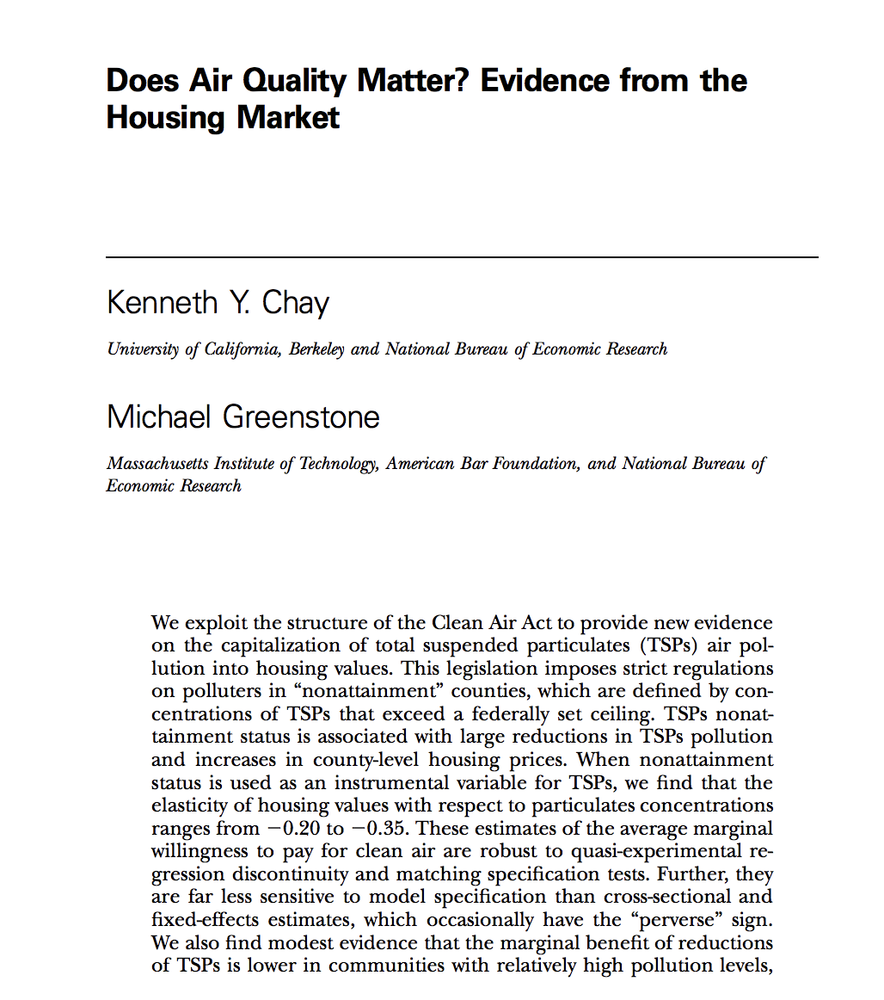
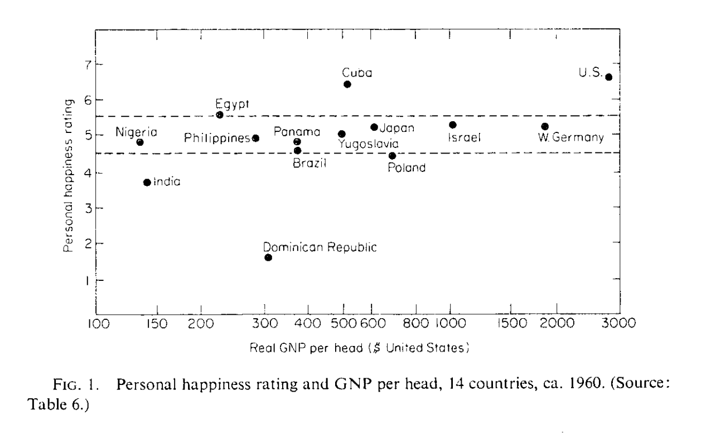

.. _section-1:

Utilitarian approach
====================

Measuring Well-Being
~~~~~~~~~~~~~~~~~~~~

**Naive utilitarian approach**

-  For each citizen :math:`i
   \in \{1,\ldots,N\}`, find the utility function :math:`U_i` which
   represents his/her preferences on the baskets found in :math:`B`

-  Suppose that the citizens obtain the baskets :math:`B_1`,
   :math:`B_2`, ..., :math:`B_N`

-  Well-being: :math:`U_1(B_1) + U_2(B_2) + \ldots + U_N(B_N)`

-  A policy :math:`\mathcal P_0` is better than an alternative
   :math:`\mathcal P_1` if it provides more well-being.

Why Naive Utilitarianism is Inadequate
~~~~~~~~~~~~~~~~~~~~~~~~~~~~~~~~~~~~~~

**Preferences are ordinal**

-  If :math:`U_1` represents the preferences of citizen :math:`1`,
   :math:`f(U_1)` represents the same preferences for any strictly
   increasing function :math:`f`

-  For example, we could have used :math:`2
   \times U_1`.

**The implications are not well defined**

-  :math:`\mathcal P_0` better if :math:`WF = U_1 + U_2`

-  :math:`\mathcal P_1` better if :math:`WF = 2U_1 + U_2`

-  Well-being should only depend on preferences and not on :math:`U`.

Compensating variations
=======================

Define Well-Being by Preferences
~~~~~~~~~~~~~~~~~~~~~~~~~~~~~~~~

**Indirect Utility**

-  Policy :math:`\mathcal P` defines a budget constraint
   :math:`C_i(\mathcal P,I_i)` for citizen :math:`i` (where :math:`I_i`
   is income)

-  The maximum utility of citizen :math:`i` given his constraint is:

   .. math:: U_i^*(\mathcal P,I_i) = \max_{B \in C_i(\mathcal P, I_i)} U_i(B)

-  Example: two goods :math:`X` and :math:`Y`. Utility
   :math:`U(X,Y) = \ln X + \ln Y`

   Policy :math:`\mathcal P`: multiplicative tax :math:`\tau` on the
   price of :math:`Y`

   | :math:`U_i^*(\mathcal P,I) = \max_{X,Y} \ln X + \ln Y`
   | s.c. :math:`\quad \quad \quad
     p_X  X + p_Y(1 + \tau) Y = I`

Compensating Variation

-  Policy :math:`\mathcal P_0` is the status quo, implementing the new
   policy :math:`\mathcal P`

-  Compensating variation : amount :math:`\Delta I^{CV}` such that

   .. math::

      U^*(\mathcal P_0,I) = U^*(\mathcal P,
      I - \Delta I^{CV})

-  Amount that we can take from the consumer while keeping his utility
   at the reference level (status quo).

-  Note: sign convention is that :math:`\Delta I^{CV}>0` when the policy
   change is *good*

**Exercise A**: Find the expression of the compensating variation for
:math:`\ln X + \ln Y` and a tax :math:`\tau` on the good :math:`Y`.

Fundamental Property
~~~~~~~~~~~~~~~~~~~~

**The compensating variation only depends on preferences:**

-  :math:`\Delta I^{CV}` only depends on preferences

   .. math::

      U^*(\mathcal P_0,I) = U^*(\mathcal P, I - \Delta I^{CV})
      \Rightarrow 2 U^*(\mathcal P_0,I) = 2  U^*(\mathcal P, I- \Delta I^{CV})

-  Generally, for any function :math:`f`,

   .. math::

      U^*(\mathcal P_0,I) = U^*(\mathcal P, I - \Delta I^{CV})
      \Rightarrow f[U^*(\mathcal P_0,I)] = f[ U^*(\mathcal P, I - \Delta I^{CV})]

Important Special Case
~~~~~~~~~~~~~~~~~~~~~~

**Quasi-linear utility**

-  Preference for a good :math:`X` and money :math:`Y`.

-  Preferences represented by :math:`U(X,Y) = V(X) + Y`

-  Reference policy :math:`\mathcal P_0`: allocation :math:`(X_0, Y_0)`

-  Change :math:`\mathcal P`: :math:`(X_1, Y_1)`.

Compensating Variation
~~~~~~~~~~~~~~~~~~~~~~

:math:`\Delta I^{CV}` such that

.. math::

   \begin{aligned}
   U(X_0,Y_0) &=& U(X_1, Y_1- \Delta I^{CV}) \\
   V(X_0) + Y_0 &=& V(X_1) + Y_1 - \Delta I^{CV} \\
   \Delta I^{CV} &=& V(X_1) + Y_1 - V(X_0) - Y_0 \\
   \Delta I^{CV} &=& U(X_1,Y_1) - U(X_0,Y_0)\end{aligned}

The compensating variation is equal to the change in utility

Consumer surplus
================

Consumer Surplus for purchases
~~~~~~~~~~~~~~~~~~~~~~~~~~~~~~

**Suppose that utility is quasi-linear**

-  Good :math:`X` and money :math:`M`. :math:`U(X,M) = V(X) + Y`

-  Suppose :math:`V` concave (:math:`dV/dX` decreasing in :math:`X`)

-  Consider :math:`\mathcal P_0` can’t buy :math:`X`

-  | Alternative :math:`\mathcal P` allows the purchase of :math:`X` at
     price :math:`p_X`
   | :math:`\max_{X,Y} U(X,Y) \quad s.t. \quad p_X X + Y = I`

-  | Equivalent to :math:`\max_{X} V(X) + I - p_X X`
   | FOC: :math:`\frac{dV}{dX}_{|X^*} =  p_X`
   | Gives the demand :math:`X^*(p_X)`

Consumer Surplus

Compensating variation from :math:`\mathcal P_0` to :math:`\mathcal P`
is the consumer surplus.

.. math::

   \begin{aligned}
   \Delta I^{CV} &=& V[X^*(p)] + I - pX^*(p) - [V(0) + I] \\
   &=& V[X^*(p)] - V(0) - p X^*(p)\end{aligned}

Loss of Well-Being Generated by a Tax
~~~~~~~~~~~~~~~~~~~~~~~~~~~~~~~~~~~~~

**Tax: going from :math:`p_X = p+t` to :math:`p_X = p` .**

-  New consumption :math:`X^*(p) > X^*(p+t)`

-  Tax revenue :math:`T
   = t\times X^*(p+t)`

-  Compensating variation

   .. math::

      \begin{aligned}
      U[X^*(p), I - pX^*(p)] - U[X^*(p+t), I - (p+t) X^*(p+t)]\end{aligned}

**Property**

-  :math:`\Delta I^{CV} > T`: how much the consumer is willing to pay to
   avoid a tax higher than the revenue generated by the government

-  Loss of well-being associated to the tax :math:`= \Delta I^{CV} - T`

.. _loss-of-well-being-generated-by-a-tax-1:

Loss of Well-Being Generated by a Tax
~~~~~~~~~~~~~~~~~~~~~~~~~~~~~~~~~~~~~

**Exercise B**: If :math:`V(X) = 10 X - \frac{1}{2}X^2`, find the loss
of well-being generated by a tax :math:`t` on the good :math:`X`.

Application: Value of clean air
===============================

Application: Value of clean air **A political question**

-  There is no market for clean air, it has to be protected (offered) by
   the government.

-  The Clean Air Act (1977): U.S. government put in place measures to
   reduce pollution.

-  E.g. 1990: Controlling vehicle emissions

-  Laws are costly to implement, paid indirectly by taxes which lead to
   higher prices

-  Question: do these measures increase well-being?

**How to answer this question**

-  Consider a change from policy :math:`\mathcal P_0`: no control, no
   costs, to :math:`\mathcal P`: pollution control which comes at a
   price

-  Compensating variation >0 (sign convention), citizens value this
   policy.

How can we do it? **Step 1: Estimate people’s preferences**

-  Find a situation where people have to balance pollution and wealth
   (consumption).

-  E.g. Buying a house. Very variable within a city.

-  **Controlling for other factors**, use data from real estate
   transactions to determine the value given to clean air

-  | e.g. Define X = measure of clean air
   | (e.g. concentration of particles)

   Estimate using econometrics
   :math:`U(X, Y) = V(X) + Y = \alpha X + \beta X^2 +Y`

Evaluating a Policy

**Calculating a compensating variation**

-  Government spends :math:`X_{GOV}`. This comes at a cost
   :math:`c\times X_{GOV}` for taxpayers (use the loss of well -being
   per dollar of tax revenue).

-  Consider a change from policy :math:`(0,0)` to
   :math:`(X_{GOV}, - c \times X_{GOV})`

-  The consumer surplus is the compensating variation
   :math:`\Delta I^{CV} =  V(X_{GOV}) - c X_{GOV} - V(0)`.

**Optimal pollution**

-  The optimal pollution value is the one which maximizes
   :math:`U(X) = V(X) + I - c X` the FOC is

   .. math:: \frac{dV}{d X}_{|X^*} = c

Evaluating the Value Given to Clean Air

   Economy <https://www.jstor.org/stable/10.1086/427462>`__

   `Chay et Greenstone (2005), Journal of Political
   Economy <https://www.jstor.org/stable/10.1086/427462>`__

Example: Noise Pollution

-  The price elasticity of houses to noise pollution is -0.2

-  The government is considering reducing the noise pollution on the
   side of a highway by 10% .

-  The engineers tell us that building the noise-cancelling wall will
   cost 1000$ per affected homeowner

-  This policy is financed by a tax which leads to a loss of well-being
   equivalent to 43 cents for every tax dollar.

**Exercise C**: Does this policy increase the well-being of the affected
homeowners?

Measuring happiness
===================

Directly measuring well-being

-  The compensating variation approach is due to `John
   Hicks <https://fr.wikipedia.org/wiki/John_Hicks>`__

-  Why not just ask people whether they are happy?

-  New-Zealand project

-  `Richard
   Easterlin <https://fr.wikipedia.org/wiki/Richard_Easterlin>`__
   popularized this ( the relation between happiness and income per head
   is almost zero)

The Easterlin Paradox

   (1974) <http://graphics8.nytimes.com/images/2008/04/16/business/Easterlin1974.pdf>`__

   `Easterlin
   (1974) <http://graphics8.nytimes.com/images/2008/04/16/business/Easterlin1974.pdf>`__

Is there a paradox?

.. figure:: wolfers.png
   :alt: `Stevenson and Wolfers (2013), AER: Papers and
   Proceedings <http://users.nber.org/~jwolfers/papers/Satiation(AER).pdf>`__

   `Stevenson and Wolfers (2013), AER: Papers and
   Proceedings <http://users.nber.org/~jwolfers/papers/Satiation(AER).pdf>`__

Using Well-Being Measures to Evaluate a Policy

-  Why not look at a policy’s impact on happiness?

-  Pros: a direct evaluation without a model takes all dimensions into
   account

-  Cons: people have different ways of measuring happiness, choosing the
   right question is difficult, many psychological effects at play

We see very few studies include these measures in policy evaluation.
However, we also see a lot of interest from governments.
