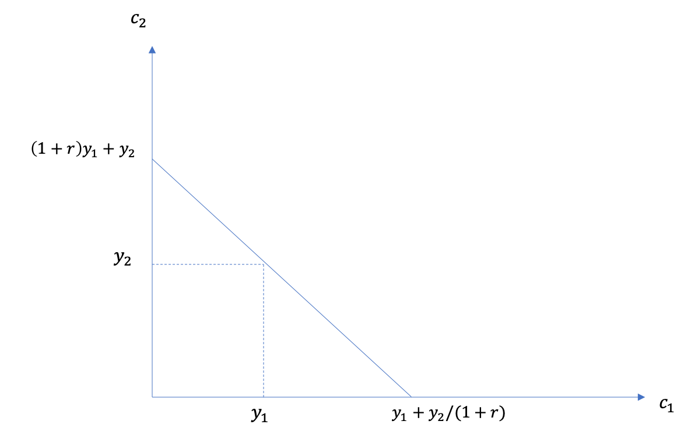

.. _section-1:

Roadmap
~~~~~~~

**Up until now**

-  Consumer choice

-  Price and income effects

-  Risk

**This class: Intertemporal choice**

-  To understand savings and durable goods consumption

**Coming up**

-  Measuring welfare and well-being

-  Market equilibrium in an exchange situation

-  Production decisions in a firm

-  Strategic behaviour of firms

-  Auctions

Preferences
===========

.. _preferences-1:

Preferences
~~~~~~~~~~~

Individuals generally prefer to benefit in the present and to delay
costs:

-  Have a coffee right now vs. at the break?

-  Go to the gym today vs. tomorrow?

-  Saving today to consume once you retire?

Discounted utility
~~~~~~~~~~~~~~~~~~

If :math:`u(C_t)` is the utility gained from consumption at time
:math:`t`, the discounted utility for a consumption plan
:math:`\textbf{C} = (C_1,...,C_T)` is :

.. math:: DU(\mathbf{C}) = \sum_{t=1}^T \delta^{t-1} u(C_t)

:math:`\delta` :math:`\in [0,1]` is the discount factor (patience)
whereas :math:`\mathbf{C} = (C_1,...,C_T)`. The relation between the
discount factor, :math:`\rho` and :math:`\delta` is given by:

.. math:: \delta = \frac{1}{1+\rho}

Marginal Rate of Substitution (MRS)
~~~~~~~~~~~~~~~~~~~~~~~~~~~~~~~~~~~

If :math:`T=2`, then

.. math:: DU(\textbf{C}) = u(C_1) +  \delta u(C_2)

. The total differential gives the MRS:

.. math:: \frac{\partial C_2}{\partial C_1}\rvert_{dDU=0} = -\frac{u'(C_1)}{\delta u'(C_2)}

Intertemporal preferences are caracterized by:

-  The discount factor (:math:`\delta`)

-  The shape of :math:`u`.

**Exercise A**: Find the MRS for :math:`u(C_t) = \log C_t`

How to Estimate Discount Rates?

An Experiment in Denmark (Harrison, Lau and Williams, 2002)

|image|

Results of Discount Rates

Expérience au Danemark (Harrison, Lau et Williams, 2002)

|image|

The Intertemporal Constraint
============================

Interest and Financial Markets

Financial institutions offer us :math:`r_S` for every dollar we deposit
(save). They also ask a compensation :math:`r_D` for each dollar lent

For now, let’s suppose :math:`r_D = r_S = r`.

Resources

Resources come from two sources:

-  initial wealth: :math:`W_0`.

-  income in both periods, :math:`Y_1`, :math:`Y_2`.

The present value of resources is :

.. math:: VP_W = W_0 + Y_1 + \frac{Y_2}{1+r}

Constraint

The present value of consumption for both periods is :

.. math:: VP_C = C_1 + \frac{C_2}{1+r}

.

Thus, the intertemporal constraint is :math:`VP_C \leq VP_W`:

.. math:: C_1 + \frac{C_2}{1+r} \leq W_0 + Y_1 + \frac{Y_2}{1+r}

Borrowing and Saving

We can rewrite the constraint such that :

.. math:: (1+r)(W_0 + Y_1 - C_1) \ge  C_2 - Y_2

Therefore,

-  The individual that saves during the first period (LHS positive) can
   consume more than his income during the second period (positive RHS).

-  The individual that borrows during the first period (LHS negative)
   can consume less than his income during the second period (negative
   RHS).

Visual

|image|

Example: Contributive Retirement Plan

A defined benefit pension plan requires savings during the first period.

-  Income in the second period is :math:`Y_2 = \phi Y_1` with
   :math:`\phi \in [0,1]`.

-  Income in the first period is reduced by the contribution,
   :math:`\tau Y_1`.

The resource constraint is therefore:

.. math:: C_1 + \frac{C_2}{1+r} \leq W_0 + (1-\tau)Y_1 + \frac{\phi Y_1}{1+r}

The contribution rate :math:`\tau` is chosen by actuaries such that :

.. math:: \tau Y_1 = \frac{\phi Y_1}{1+r_P} \to \tau = \frac{\phi}{1+r_P}

where :math:`r_P` is the yield of the pension plan. If :math:`r_P = r`,
the budget constraint does not change! consumption doesn’t change when
:math:`\phi` increases and savings will then adjust (Crowding out).

Rate Differentials

**Exercise B**: What will the constraint look like if :math:`r_S<r_D`?

**Exercise C**: How do we represent a situation where an individual
cannot borrow?

Optimal Choice
==============

Maximization

The problem is (set :math:`W_0=0` to simplify):

.. math:: \max_{C_1,C_2} \{ u(C_1) + \delta u(C_2) : C_1+C_2/(1+r) \leq Y_1 + Y_2/(1+r)\}

Two approaches:

#. Direct approach (constraint substitution)

#. Lagrangian

Optimality condition

The lagrangian gives 3 FOC:

.. math::

   \begin{aligned}
    u'(C_1) - \lambda = 0  \\
   \delta u'(C_2) - \lambda /(1+r) = 0  \\
   C_1+C_2/(1+r) - Y_1 - Y_2/(1+r) = 0  \end{aligned}

With (1) and (2) we find that :

.. math:: \frac{u'(C_1)}{\delta u'(C_2)} = 1+r

By rearranging and setting :math:`R=1+r`, we obtain Euler’s equation:

.. math:: u'(C_1) = R\delta u'(C_2)

Visual |image|

Example

**Exercise D**: Solve to find the optimal choice of :math:`C_1` and
:math:`C_2` if :math:`u(C)=\frac{C^{1-\sigma}}{1-\sigma}`

Example: Are We Saving Enough?

There is a lot of literature and an important public debate to determine
whether people are saving enough for retirement.

.. figure:: retraite.png
   :alt: Le Conseiller, Globe and Mail, L’Actualité

   Le Conseiller, Globe and Mail, L’Actualité

Replacement Rate

.. figure:: mckinsey.png
   :alt: McKinsey (2015)

   McKinsey (2015)

Optimal Saving Level

What does theory say about how much people should save?

**Exercise E**: Find an expression for the optimal savings level at the
beginning of period 2 if :math:`u(C)=\frac{C^{1-\sigma}}{1-\sigma}` and
the constraint is given by:

.. math:: C_1 + \frac{C_2}{1+r} \leq (1-\tau)Y_1 + \frac{\phi Y_1}{1+r}

Example: Are We Saving Enough?

We can take into account preferences by simulating how much people
should be saving (and comparing it to reality).

.. figure:: savings.png
   :alt: Scholz et al. (2007, Journal of Political Economy)

   Scholz et al. (2007, Journal of Political Economy)

Bias towards the present
========================

Present-bias: Choosing a movie

You have to choose a movie to watch tonight and a movie that you will
watch next week:

Preference Bias - The Present

Suppose that "Mommy" has an immediate benefit of 4 and a future benefit
of 4 but that "Les Boys" has an immediate benefit of 7 (no future
benefit).

**Exercise F**: What is the discounted utility if you’re choosing for
today and :math:`\delta=1`. What if you’re choosing for next week?

Preference Bias - The Present

Laibson (1997) suggests the quasi-hyperbolic discounted utility:

.. math:: QH(\mathbf{c}) = u(C_1) + \beta \sum_{t=2}^T \delta^{t-1} u(C_t)

**Exercise G**: What is the MRS between consumptions :math:`C_1` and
:math:`C_2`? And :math:`C_2` vs. :math:`C_3`? Compare with the expected
utility.

Preference Bias - The Present

Using these two movies, suppose :math:`\beta=0.5`.

**Exercise H**: Which film would you choose for today with preferences
biased towards the present? What about choosing for next week?

Example: Why Buy a Gym Membership?

A single-use pass costs 10$. The cost per visit of people buying a
membership is far higher than 10$.

.. figure:: Gym.png
   :alt: Della Vigna et Malmendier (2006)

   Della Vigna et Malmendier (2006)

Example: How Can We Help People Save?

-  Saving is like exercising: costly in the short run, beneficial in the
   long run.

-  We could decide to change the default option (a well-known mechanism
   in psychology): opt-in vs. opt-out (nudges, related to prospect
   theory)

-  Shea et Madrian (2001, QJE) show that savings go up significantly in
   the short run within firms using the opt-out default option

The Power of Nudges Participation increases significantly among new
employees.

.. figure:: shea.png
   :alt: Shea et Madrian (2001, QJE)

   Shea et Madrian (2001, QJE)

.. |image| image:: Results.png

.. |image| image:: optimal.png
